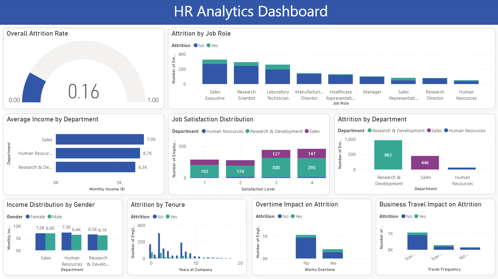

# HR Analytics: Employee Attrition Analysis Project

## Problem Statement
The company was experiencing high employee turnover and needed to understand why employees were leaving, which departments were most affected, and how to reduce hiring costs while improving retention.

## Project Objective
To analyze employee data patterns, identify key factors driving attrition, and provide actionable recommendations to improve employee retention and reduce turnover costs.

## My Approach
- **Data Preparation**: Cleaned and standardized employee data using Power Query, ensured data consistency across departments and roles
- **Data Analysis**: Examined attrition patterns across departments, job roles, tenure, and work conditions
- **Business Insights**: Identified high-risk areas and root causes of employee turnover
- **Data Visualization**: Created Power BI dashboard to track key HR metrics and trends

## Tools and Techniques Used
- **Power BI**: For data preparation, analysis, and interactive dashboard creation
- **Power Query**: For data cleaning and transformation
- **Data Analysis**: Pattern identification in employee behavior and turnover drivers
- **Data Dictionary**: Documented all data fields and definitions for clarity

## Key Performance Indicators (KPIs)
1. **Overall Attrition Rate**: Percentage of employees who left the company
2. **Attrition by Department**: Which departments have the most turnover
3. **Attrition by Job Role**: Which specific jobs have the highest turnover
4. **Average Monthly Income by Role**: How pay varies across different positions
5. **Years at Company vs Attrition**: How long employees stay before leaving
6. **Overtime Effects**: How working extra hours affects turnover
7. **Promotion Impact**: How promotions affect whether people stay
8. **Income Distribution**: How salaries are spread across departments
9. **High-Risk Employees**: Identifying employees who might leave soon
10. **Employee Satisfaction**: How happy employees are across departments

## Dashboard

## Key Insights

### Insight 1: Sales Representative Crisis
**Finding**: Sales Representatives have the highest attrition rate at 40%, with 33 out of 83 employees leaving.

**Business Impact**: This role is critical for revenue generation. High turnover damages customer relationships, increases recruitment costs, and disrupts sales continuity.

**Recommendations**:
- Review compensation and commission structures for competitiveness
- Enhance sales training and professional development programs
- Conduct detailed exit interviews to understand departure reasons
- Implement retention bonuses and career path planning for top performers

### Insight 2: Early-Career Attrition Problem
**Finding**: Most employees leave within their first two years - 73 in Year 1 and 68 in Year 2.

**Business Impact**: Significant financial loss from recruitment and training investments, plus loss of organizational knowledge and continuity.

**Recommendations**:
- Develop comprehensive onboarding and mentorship programs
- Provide better manager training for supporting new employees
- Initiate career development conversations before the two-year mark
- Create early-career growth opportunities and clear progression paths

### Insight 3: Overtime Burnout Concern
**Finding**: Employees working overtime have 31% turnover rate compared to 10% for non-overtime workers.

**Business Impact**: Excessive overtime leads to employee burnout, indicates potential workload imbalances, and reduces overall job satisfaction and productivity.

**Recommendations**:
- Analyze departments with highest overtime rates for workload distribution
- Implement workload balancing across teams and departments
- Provide additional support and resources for high-overtime roles
- Review overtime compensation and recognition programs

## Summary
This analysis identifies three critical areas for improving employee retention: addressing the sales team turnover crisis, enhancing support for early-career employees, and managing overtime-related burnout. Implementing targeted solutions in these areas could significantly reduce hiring costs, preserve valuable institutional knowledge, and create a more stable, satisfied workforce.

The project demonstrates how HR analytics can transform employee data into strategic insights, enabling evidence-based decisions for talent management and organizational development.
